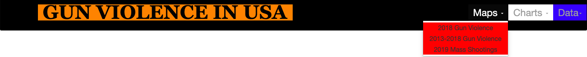
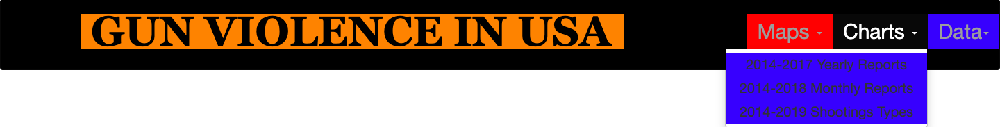

# GUN VIOLENCE IN THE USA   

### By George Oddoye & Minu Khosla, Vidhya.J

## Inspiration

There has been a steady increase in gun violence over the past decade and this trend shows no signs of slowing down. In fact, it is not uncommon to turn on the news and hear about a new mass shooting event that has occured somewhere in the nation. This year alone there have been mass shooting events in Virginia Beach, Virginia (13 Killed/4 Injured), El Paso, Texas (22 Killed/24 Injured), and Dayton, Ohio (10 Killed/27 Injured). In total there were 409 mass shooting events in 2019 resulting in 486 killed and 1642 injured. Gun control is a very sensitive and widely debated topic in The United States of America which has caused it to become highly politicised.

The two major political parties in the United States (Democrats/Republicans) have drastically different views and opinions on the subject. Until such a time comes where both sides can come to agreement on gun control it appears that the current positive trend in gun violence will continue to occur. This is what provided the inspiration for the creation of this website. As Data Analysts we can help analyze this dire situation by studying gun violence data and help provide well informed predictions about future trends in order to build strategies that will eventually minimize gun violence, and promote gun safety.

## Goal

Our goal was to create a fully functional web visualization dashboard that provides gun violence data in an easily understandable manner . 

## User-driven interaction

We created this website to have a fully interactive navigation bar including dropdown menus for the user to choose different views. Each view is either a Map or a Chart dipicting Data that could be used to analyse and see trends to draw conclusions . The user also has the ability to switch the website into darkmode with the click of a button. All of the maps and charts are interactive as well.The "Data page" shows all the data utilized in this project.

#### 1) We Created a Maps Tab which included:

###### Cluster Map of gun violence that occured in America during 2018

###### Heat Map of gun violence between 2013-2018

######  Choropleth Map of mass shootings in 2019

#### 2) We Created a Charts Tab which included:

######  Line Chart displaying Gun Violence from Jan 2014 to Mar 2018 on a monthly basis

######  Bar Chart displaying Gun Violence from Jan 2014 to Dec 2017 Yearly Reports

######  Pie Chart displaying Types of Gun Violence during 2014-2019 on a yearly basis

#### 3) We created a Data Tab which included all data used in our project and a SCORECARD for Gun Contol 

###### Countrywide scorecard by State that displays how effectively gun control laws when implemented at a State Level did show significant reduction in gun violence .

# Methods and Tools that we used

## Data Source

Our dataset was obtained from “Gun Violence Data” (https://www.kaggle.com/jameslko/gun-violence-data) as well as https://www.gunviolencearchive.org. This dataset contains more than 260k gun violence incidents, in the US between January 2013 and March 2018 , with detailed information about each incident, in CSV format. In order to collect 2019 data we had to download the data from https://www.gunviolencearchive.org in csv format.

### Extraction

Data was extracted from  a CSV file.

### Transformation
1.	We read the CSV file into data frame and transformed it .
2.	We parsed Data in some columns , counted and stored in additional columns.
3.	Irrelevant columns were dropped. We renamed and rearranged columns and changed data types to maintain uniformity and present meaningful data.
 
We laoded the Data frame into relational database – Postgres.

### Flask Application 
Flask application was utilized and data from the Postgres database was derived to create endpoints that contained json objects of necessary data from which  we built maps and charts.
We also utilized Flask to render the HTML template created to display all the features on the client web browser.

### HTML pages
We created HTML pages for each visualization of the maps and charts such that each page had access  to the JavaScript file in order to  display  the dashboard features on the browser . 

### JavaScript file 
 We have used D3.js , Plotly and Leaflet libraries to provide the basic framework for building the USA gun violence information maps and the different types of charts . 

Darkmode.js was an additional Javascript library that we used to enhance the user experience.

 ## link to the primary GitHub repository   

https://github.com/GitGTBoot/DataVisualizations-Project
